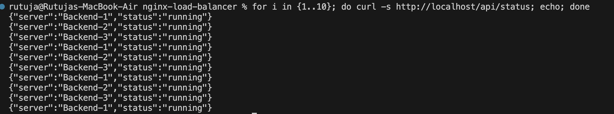
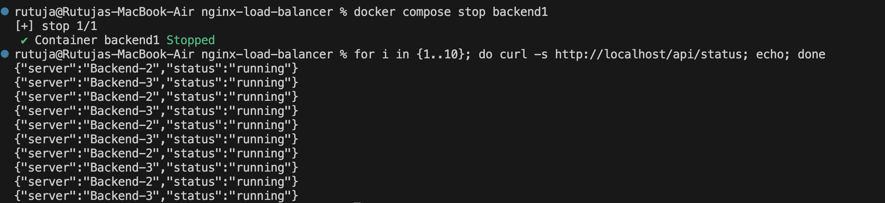

# Nginx Load Balancer

A Docker-based **Nginx Reverse Proxy and Load Balancer** that distributes incoming traffic across multiple backend servers and provides basic failure handling.

## Architecture

```text
                         Client
                           |
                           v
                    +-------------+
                    |    NGINX    |
                    | Reverse     |
                    | Proxy       |
                    |     +       |
                    | Load        |
                    | Balancer    |
                    +------+------+
                           |
              +------------+------------+
              |            |            |
              v            v            v
        +----------+  +----------+  +----------+
        | Backend 1|  | Backend 2|  | Backend 3|
        |  :3000   |  |  :3000   |  |  :3000   |
        +----------+  +----------+  +----------+
              |            |            |
              +------------+------------+
                           |
                           v
                    Node.js + Express
                           |
                  +--------+--------+
                  |                 |
             Health Checks       Logs
```

## Load Balancing



Nginx distributes incoming requests across multiple backend instances, improving availability and scalability.

## Failure Handling



If a backend instance becomes unavailable, Nginx routes requests to the available backend servers.

## Tech Stack

* **Nginx** — Reverse Proxy & Load Balancer
* **Docker** — Containerization
* **Docker Compose** — Service Orchestration
* **Node.js & Express** — Backend Services

## Run Locally

```bash
docker compose up --build
```

Access the application through the Nginx server.

## Project Structure

```text
Nginx-Load-Balancer/
├── backend/
├── frontend/
├── nginx/
├── images/
│   ├── load-balancing.png
│   └── failure-handling.png
├── logs/
├── docker-compose.yml
└── README.md
```

## Key Concepts

* Reverse Proxy
* Load Balancing
* Fault Tolerance
* Health Checks
* Docker Networking
* Backend Failure Handling

---

**Built to demonstrate Nginx load balancing, reverse proxying, and fault-tolerant architecture using Docker.**
